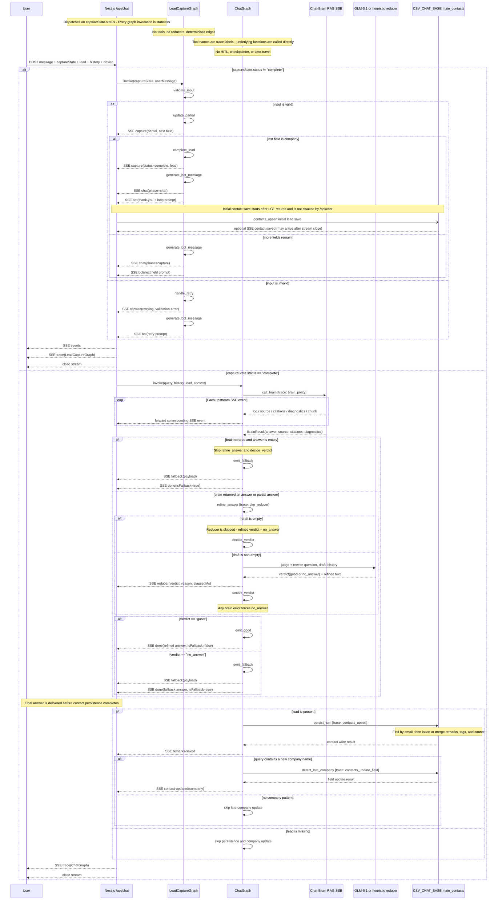

# GEM Customer Chatbot — Sequence Diagram

Live LangGraph conversion. Two state machines, no HITL, no checkpointer, no time-travel.

## Mermaid



## Verification

This diagram was verified against the actual source code on 2026-09-26:

- **LG1 edges** (`src/lib/graphs/lead-capture-graph.ts`): `validate_input → (update_partial | handle_retry)`, `update_partial → (complete_lead | generate_bot_message)`, `complete_lead → generate_bot_message`, `handle_retry → generate_bot_message`, `generate_bot_message → END` ✓
- **LG2 `call_brain` routing** (`routeAfterCallBrain`): `if brain.error && !answer.trim() → emit_fallback, else → refine_answer` ✓
- **`refine_answer` empty-draft skip**: `if !raw → verdict=no_answer (skips LLM call)` ✓
- **`decide_verdict` override** (`decideVerdictNode`): `if brain.error → force no_answer` ✓
- **Initial contact save is fire-and-forget** (`/api/chat` route): `.then()` not awaited — `contact-saved` SSE may arrive after stream close ✓
- **SSE events match**: capture, chat, bot, source, citations, diagnostics, chunk, reducer, fallback, done, remarks-saved, contact-updated, contact-saved, trace ✓

## Graph structure

### LG1 — LeadCaptureGraph

```
START → validate_input →─→ update_partial →─→ complete_lead → generate_bot_message → END
                        │                  └──(not last)──────────────────────────┘
                        └─(invalid)─→ handle_retry ─────────────────────────────────┘
```

- **No tools, no reducers** (last-write-wins on every channel)
- **Hardcoded edges only** — branching is deterministic via `addConditionalEdges`
- 5 nodes: `validate_input`, `update_partial`, `complete_lead`, `handle_retry`, `generate_bot_message`

### LG2 — ChatGraph

```
START → call_brain → refine_answer → decide_verdict →─→ emit_good   ──→ persist_turn → detect_late_company → END
                       (or jump to emit_fallback       └─(no_answer)─→ emit_fallback ──┘
                        if brain errored with no answer)
```

- **4 tools**: `brain_proxy`, `glm_reducer`, `contacts_upsert`, `contacts_update_field` (trace labels — functions called directly from nodes)
- **No HITL / checkpointer / time-travel** — every request runs the graph to completion in one shot
- 7 nodes: `call_brain`, `refine_answer`, `decide_verdict`, `emit_good`, `emit_fallback`, `persist_turn`, `detect_late_company`

## Live SSE streaming

Brain chunks are forwarded to the client in real time via an `emit` callback held in graph state (non-serializable, but fine since there's no checkpointer). The user sees a "Thinking…" indicator while the brain + reducer work, then the final refined answer appears all at once — streaming chunks are accumulated internally and never rendered until the `done` event.

## Environment

| Variable | Default | When to set |
|-----------|---------|-------------|
| `CHAT_BRAIN_URL` | `https://tradingview-notes-app.vercel.app/api/brain/chat` | Only if you self-host the brain |
| `CSV_CHAT_BASE` | `https://csv-chat-vercel.vercel.app` | (Supabase creds below) |
| `OPENCODE_MODEL` | `glm-5.1` | Only if you want a different model |
| `CHAT_INACTIVITY_MS` | `120000` | Only if you want shorter/longer timeout |

Business contact (phone, email) is hardcoded in `src/lib/config.ts` — not an env var.
