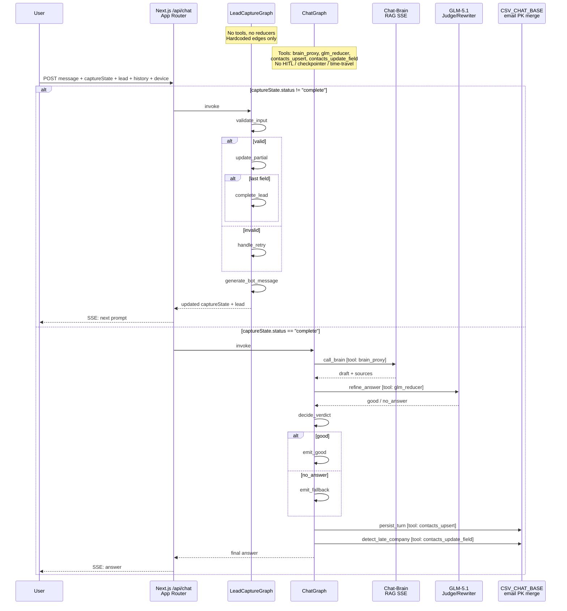

# GEM Customer Chatbot — Sequence Diagram

Live LangGraph conversion. Two state machines, no HITL, no checkpointer, no time-travel.

## Mermaid



## Text (original)

```
Live LangGraph conversion - Phase 7-8 complete, tools mapped, no HITL

participant U as User
participant NX as Next.js /api/chat (App Router)
participant LG1 as LeadCaptureGraph
participant LG2 as ChatGraph
participant BRAIN as Chat-Brain (RAG SSE)
participant JUDGE as GLM-5.1 (Judge/Rewriter)
participant DB as CSV_CHAT_BASE (email PK merge)

Note over LG1: No tools, no reducers. Hardcoded edges only
Note over LG2: Tools: brain_proxy, glm_reducer, contacts_upsert, contacts_update_field
               No HITL / checkpointer / time-travel

U->NX: POST message + captureState + lead + history + device
alt captureState.status != "complete"
    NX->LG1: invoke
    LG1->LG1: validate_input
    alt valid
        LG1->LG1: update_partial
        alt last field
            LG1->LG1: complete_lead
        end
    else invalid
        LG1->LG1: handle_retry
    end
    LG1->LG1: generate_bot_message
    LG1-->NX: updated captureState + lead
    NX-->U: SSE: next prompt
else captureState.status == "complete"
    NX->LG2: invoke
    LG2->BRAIN: call_brain [tool: brain_proxy]
    BRAIN-->LG2: draft + sources
    LG2->JUDGE: refine_answer [tool: glm_reducer]
    JUDGE-->LG2: good / no_answer
    LG2->LG2: decide_verdict
    alt good
        LG2->LG2: emit_good
    else no_answer
        LG2->LG2: emit_fallback
    end
    LG2->DB: persist_turn [tool: contacts_upsert]
    LG2->DB: detect_late_company [tool: contacts_update_field]
    LG2-->NX: final answer
    NX-->U: SSE: answer
end
```

## Graph structure

### LG1 — LeadCaptureGraph

```
START → validate_input →─→ update_partial →─→ complete_lead → generate_bot_message → END
                        │                  └──(not last)──────────────────────────┘
                        └─(invalid)─→ handle_retry ─────────────────────────────────┘
```

- **No tools, no reducers** (last-write-wins on every channel)
- **Hardcoded edges only** — branching is deterministic via `addConditionalEdges`
- 5 nodes: `validate_input`, `update_partial`, `complete_lead`, `handle_retry`, `generate_bot_message`

### LG2 — ChatGraph

```
START → call_brain → refine_answer → decide_verdict →─→ emit_good   ──→ persist_turn → detect_late_company → END
                       (or jump to emit_fallback       └─(no_answer)─→ emit_fallback ──┘
                        if brain errored with no answer)
```

- **4 tools**: `brain_proxy`, `glm_reducer`, `contacts_upsert`, `contacts_update_field`
- **No HITL / checkpointer / time-travel** — every request runs the graph to completion in one shot
- 7 nodes: `call_brain`, `refine_answer`, `decide_verdict`, `emit_good`, `emit_fallback`, `persist_turn`, `detect_late_company`

## Live SSE streaming

Brain chunks are forwarded to the client in real time via an `emit` callback held in graph state (non-serializable, but fine since there's no checkpointer). The user sees a "Thinking…" indicator while the brain + reducer work, then the final refined answer appears all at once — streaming chunks are accumulated internally and never rendered until the `done` event.

## Environment

| Variable | Default | When to set |
|-----------|---------|-------------|
| `CHAT_BRAIN_URL` | `https://tradingview-notes-app.vercel.app/api/brain/chat` | Only if you self-host the brain |
| `CSV_CHAT_BASE` | `https://csv-chat-vercel.vercel.app` | (Supabase creds below) |
| `OPENCODE_MODEL` | `glm-5.1` | Only if you want a different model |
| `CHAT_INACTIVITY_MS` | `120000` | Only if you want shorter/longer timeout |

Business contact (phone, email) is hardcoded in `src/lib/config.ts` — not an env var.
